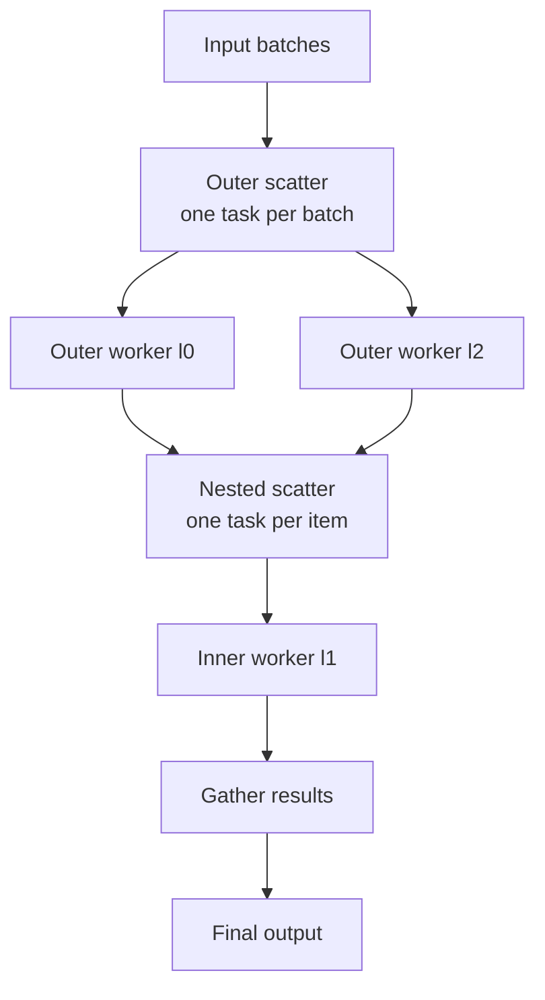

```mermaid
flowchart TD
  Input["Input batches"]
  Outer["Outer scatter\none task per batch"]
  L0["Outer worker l0"]
  L2["Outer worker l2"]
  Inner["Nested scatter\none task per item"]
  L1["Inner worker l1"]
  Gather["Gather results"]
  Output["Final output"]

  Input --> Outer
  Outer --> L0
  Outer --> L2
  L0 --> Inner
  L2 --> Inner
  Inner --> L1
  L1 --> Gather
  Gather --> Output

```